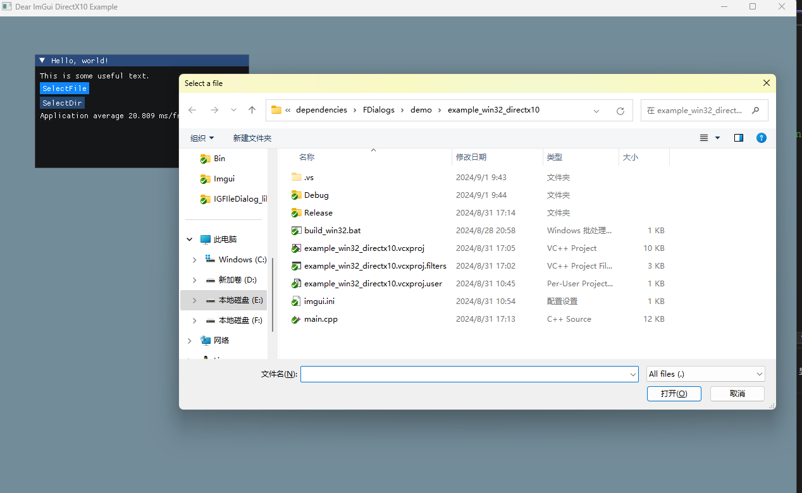
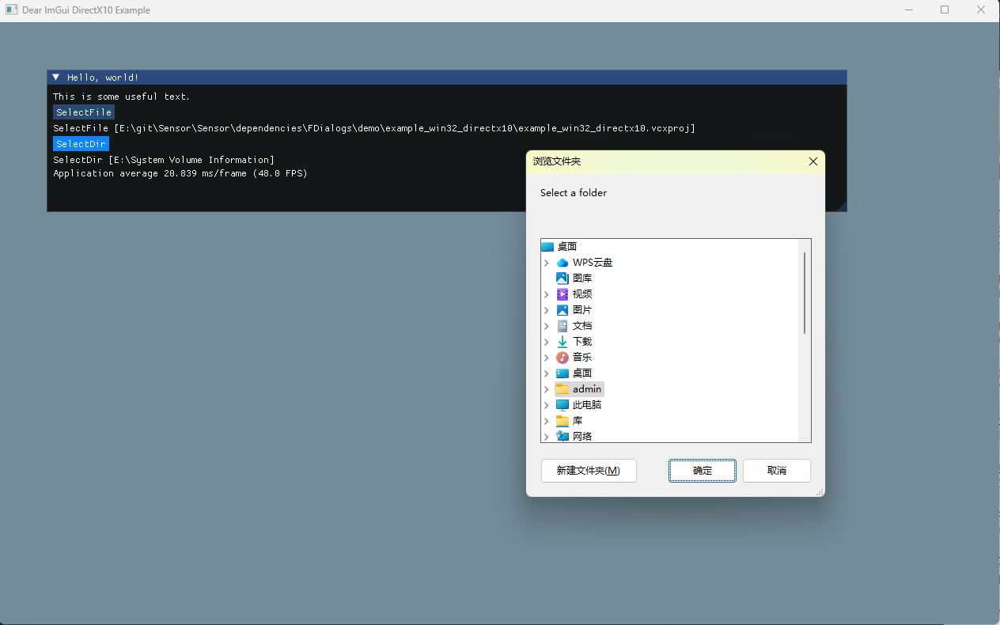
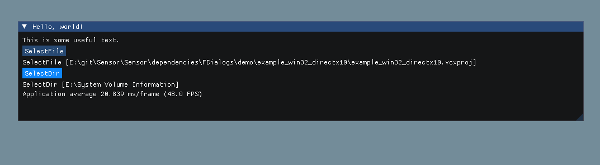

The file selection interfaces based on ImGui encapsulation are somewhat lacking in visual appeal. In light of this, we plan to adopt the system's native folder selection interface to enhance the user experience. Currently, this feature is only supported on Windows operating systems. For other platforms, we warmly invite those who are interested to participate in the encapsulation process, offering everyone a fresh alternative.

